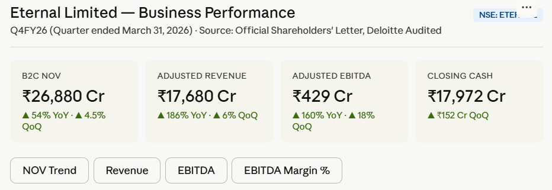
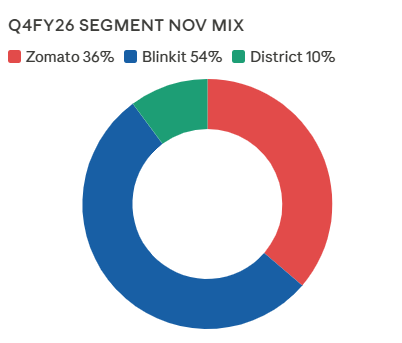

# Eternal Limited — Business Performance Analytics

Interactive business analytics dashboard built using Python, SQL, and Streamlit using publicly available quarterly shareholder reporting data of Eternal Limited (NSE: ETERNAL).

---

# Overview

This project analyses the Q4FY26 business performance of Eternal Limited across its major business segments:

* Zomato (Food Delivery)
* Blinkit (Quick Commerce)
* District (Going-Out)
* Hyperpure

The dashboard focuses on operational KPIs, growth trends, profitability metrics, and business expansion indicators to simulate a real-world business analytics workflow.

The goal of the project was not just to visualise numbers, but to understand the business drivers behind customer growth, operational scale, and revenue expansion.

---

# Business Problem

Large consumer internet businesses operate across multiple business segments with different growth patterns, profitability structures, and operational challenges.

The challenge was to:

* Track YoY and QoQ business growth
* Monitor profitability and operational efficiency
* Compare performance across business segments
* Identify high-growth operational areas
* Build executive-friendly KPI dashboards for business monitoring

---

# Dashboard Preview

## Executive KPI Dashboard



---

## Segment Performance Scorecard


---

## NOV & Revenue Trend Analysis


---

## Business Segment Mix Analysis



---

# Key Features

* Executive KPI scorecards
* YoY and QoQ growth analysis
* Segment-wise business comparison
* Revenue and EBITDA tracking
* Blinkit store expansion analysis
* Cash flow monitoring
* Operational business insights
* Interactive Streamlit visualisations

---

# Key Business Insights

### Blinkit showed the strongest growth momentum

Quick commerce continued to be the fastest-growing business segment with aggressive store expansion and high NOV growth.

### Food delivery margins remained stable

Despite increasing competition and lower-value orders, food delivery margins remained relatively resilient.

### Business diversification improved overall scale

The company’s revenue growth was supported by multiple business segments including food delivery, quick commerce, and going-out services.

### Store expansion remained a major growth driver

Higher store density and geographic expansion contributed significantly to operational scale and customer adoption.

---

# Tech Stack

| Category        | Tools Used         |
| --------------- | ------------------ |
| Programming     | Python             |
| Data Analysis   | Pandas             |
| Dashboarding    | Streamlit          |
| Visualisation   | Plotly, Matplotlib |
| Database        | SQL                |
| Version Control | Git, GitHub        |

---

# Project Workflow

1. Collected publicly available quarterly shareholder reporting data
2. Cleaned and organised business metrics
3. Structured KPI datasets for analysis
4. Built Streamlit dashboards for executive reporting
5. Performed business trend and growth analysis
6. Created segment-wise operational scorecards

---

# Dataset Source

Publicly available shareholder reporting and quarterly business performance disclosures of Eternal Limited.

Source:

* Q4FY26 Shareholders’ Letter
* Deloitte Audited Quarterly Results
* NSE: ETERNAL

---

# Folder Structure

```bash
eternal-business-performance-analytics/
│
├── app.py
├── README.md
├── requirements.txt
│
├── data/
│   └── Q4FY26_Shareholders_Report.pdf
│
└── screenshots/
    ├── dashboard_overview.png
    ├── nov_trend.png
    ├── segment_mix.png
    └── scorecard.png
```

---

# How to Run

## Clone Repository

```bash
git clone https://github.com/gaurav-s23/eternal-business-performance-analytics.git
```

## Open Project Folder

```bash
cd eternal-business-performance-analytics
```

## Install Dependencies

```bash
pip install -r requirements.txt
```

## Run Streamlit App

```bash
streamlit run app.py
```

---

# Future Improvements

* Add advanced KPI filters
* Add historical quarterly comparison
* Add profitability forecasting
* Add automated PDF data extraction
* Add SQL-based backend integration

---

# Author

## Gaurav Shukla

Data Analyst | SQL | Python | Streamlit | Power BI

* GitHub: [https://github.com/gaurav-s23](https://github.com/gaurav-s23)
* LinkedIn: [https://linkedin.com/in/gaurav-shukla](https://linkedin.com/in/gaurav-shukla)

---

# Project Status

Active Development — dashboards and analytics modules are being expanded continuously.
